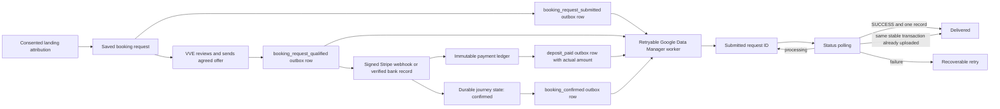

# Booking measurement release record

Prepared 24 September 2026; external setup verified 27 September 2026 on `codex/booking-measurement-final-20260924`. This document records the implementation and the release gates. It does not claim a production release.

## Architecture decision

Use the existing Google tag for consent-aware browser diagnostics and the existing WhatsApp click action, which is recommended to remain Secondary pending Google Ads dashboard verification. Use the Google Data Manager API for committed booking milestones. GA4 and Google Tag Manager are not required for this flow and are not added by this change.

This is the smallest reliable design because the request, qualification, verified payment and confirmed state can happen on different devices and days. Their authoritative state is in the database, not a browser success page. Data Manager accepts offline click conversions, provides an asynchronous request ID and exposes a status endpoint that the worker can reconcile before marking delivery successful.

## Canonical event contract

| Event | Authoritative trigger | Stable identity | Value | Intended Google Ads role |
|---|---|---|---|---|
| `booking_request_submitted` | First committed modern website booking row | `booking:<booking UUID>:booking_request_submitted` | none | Secondary |
| `booking_request_qualified` | Journey first enters `offered` or `confirmed` after VVE review | `booking:<booking UUID>:booking_request_qualified` | none | Secondary during validation |
| `deposit_paid` | First verified `deposit` or `manual_deposit` payment-ledger row | opaque Stripe `cs_*` ID; PII-free canonical event key for bank deposits | actual received amount in GBP | Secondary during validation; intended future Primary |
| `booking_confirmed` | Journey first enters durable `confirmed` state **and an authoritative deposit ledger row exists** | `booking:<booking UUID>:booking_confirmed` | none | Secondary |
| `whatsapp_contact` | Consented public-site WhatsApp click | existing separate Website action | none | Recommended Secondary; dashboard status unverified |

`deposit_paid` and `booking_confirmed` are intentionally separate. A valid late payment can require staff review instead of confirming an expired or changed appointment. A no-deposit/after-clean confirmation is excluded from `booking_confirmed` measurement. They must not both become bidding goals for the same customer outcome.

The browser no longer emits a second `booking_request_submitted` conversion. It emits only `booking_request_response_received` as a non-conversion diagnostic after the saved-response arrives. Old aliases `request_submitted` and `whatsapp_click` are not emitted.

## Consent, attribution and privacy

- All four Consent Mode v2 signals default to denied before the Google tag is loaded: `ad_storage`, `analytics_storage`, `ad_user_data`, and `ad_personalization`.
- Advertising attribution is written only after affirmative advertising consent. Changing Cookie settings clears attribution in that browser. For an already-saved request, the service-role withdrawal operation clears stored hashes/click data and suppresses rows not already accepted by Google; an authorised operator must invoke it after a customer asks to withdraw.
- First touch is immutable. The booking stores `gclid`, `gbraid`, `wbraid`, UTM source/medium/campaign/term/content, the query-free landing path and the original first-touch timestamp.
- Consented email and UK/E.164 phone values are normalised and SHA-256 hashed server-side for approved enhanced-conversion matching. Raw customer details do not enter the outbox, Data Manager payload, URLs, event names, transaction IDs, acknowledgements or logs.
- Synthetic preview records are marked as tests and suppressed. Records without advertising consent or a supported matching identifier are suppressed rather than uploaded.
- Raw attribution and matching hashes are purged after 90 days from first touch. For legacy outbox rows that predate the first-touch snapshot, retention safely falls back to the outbox `created_at` time. Measurement audit rows have a separate 400-day retention function. The purge is invoked by the existing protected 10-minute worker once this code is deployed; this branch does not activate or alter the production schedule.

## Google Ads action specification

The separate Ads task created the four import actions on 24 September. Their existence and Secondary status were verified in the Google Ads dashboard on 27 September. Do not create duplicates. This website task has made zero Google Ads-account changes.

Account `556-909-9303` has these existing action IDs:

| Event | Action ID |
|---|---|
| `booking_request_submitted` | `7793322917` |
| `booking_request_qualified` | `7793447502` |
| `deposit_paid` | `7793447505` |
| `booking_confirmed` | `7793447508` |

The four import actions are enabled, Secondary and awaiting conversions. Their click-through window is 90 days; the independent Ads-task readback records data-driven attribution. The deposit action uses uploaded values with a zero fallback; the other three have no value. The source record is the separate Ads project's `generated/vve_20260924_offline_conversion_actions_applied.md` and independent readback, not a change made by this repository.

| Exact action name | Source/type | Category | Count | Value | Initial goal setting |
|---|---|---|---|---|---|
| Booking Request Submitted | Website — Import from clicks (`UPLOAD_CLICKS`) | Submit lead form | One | no value | Secondary |
| Qualified Booking Request | Website — Import from clicks (`UPLOAD_CLICKS`) | Qualified lead | One | no value | Secondary |
| Deposit Paid | Website — Import from clicks (`UPLOAD_CLICKS`) | Purchase | Every | use uploaded actual value and GBP | Secondary until reconciled, then sole Primary funnel goal |
| Booking Confirmed | Website — Import from clicks (`UPLOAD_CLICKS`) | Converted lead | One | no value | Secondary |
| WhatsApp Contact (Secondary) | Website / Google tag | Contact | One | no value | Verified Secondary, Active, 30-day click window |

Use Google Ads data-driven attribution. Do not configure the server events as normal Website/`WEBPAGE` actions, do not import the same events again through GA4, and do not make the request, qualification, confirmation or WhatsApp stages additional primary bidding goals.

The legacy `Booking Deposit Paid` action is unchanged in Google Ads. On 27 September its dashboard state was Primary / Misconfigured. Its historic confirmation page remains deliberately analytics-free and its retired conversion block remains unreachable. The current emailed-payment journey does not return to that page. This branch does not reactivate or fire the old fixed-£30 event. `Booking Started (Secondary)` was Active / Secondary; `Contact Form Submitted (Secondary)` was Misconfigured / Secondary. These observations do not establish end-to-end receipt of the new server events or campaign-level goal selection.

### Existing source-side Google identifiers

These identifiers are already present in the repository and are unchanged by this implementation. Their ownership, enabled state, goal role and recent receipt status must still be checked in Google Ads; source inspection cannot establish account-side configuration.

| Source-side item | Identifier | Repository evidence | Verified conclusion |
|---|---|---|---|
| Google tag base | `AW-18214693277` | `index.html:90-98` | Tag exists in source; dashboard destinations unverified |
| Booking initiated action | `AW-18214693277/cmLZCIm-6eEcEJ3TuO1D` | `src/lib/analytics.ts:25-29`, `:57-60` | Unchanged; intended diagnostic/secondary action |
| WhatsApp contact action | `AW-18214693277/zzetCIy-6eEcEJ3TuO1D` | `src/lib/analytics.ts:25-29`, `:52-55` | Unchanged; recommended Secondary pending dashboard check |
| Contact form action | `AW-18214693277/XA4UCI--6eEcEJ3TuO1D` | `src/lib/analytics.ts:25-29`, `:70-75` | Unchanged; account-side role unverified |
| Legacy deposit action | `AW-18214693277/hUwdCK68gswcEJ3TuO1D` | `public/confirmation.html:625` | Unchanged and retained only in an unreachable retired block |

`phone_contact` has no hardcoded Ads action label; it remains a separate consent-aware browser event (`src/lib/analytics.ts:48-50`). Optional GA4 is environment-driven through `VITE_GA4_MEASUREMENT_ID` (`src/lib/analytics.ts:93-100`). No production `G-*` value is established by this repository review, and GA4 dashboard configuration remains unverified.

## Exact implementation responsibility

| Responsibility | Exact repository location |
|---|---|
| Consent Mode defaults before tag load | `index.html:44-87` |
| Browser diagnostic/contact events and existing Ads labels | `src/lib/analytics.ts:25-100` |
| Advertising-consent storage, immutable first touch, click IDs and withdrawal clearing | `src/lib/attribution.ts:155-167`, `:207-340` |
| Booking form request identity, attribution payload and success-only diagnostic | `src/pages/BookingPage.tsx:732-779`, `:955` |
| Request validation, replay protection, consented hashes/test marker and durable save | `api/create-booking-request.js:365-411`, `:496-581` |
| Atomic request/qualification/deposit/confirmation event creation and retention | `supabase/migrations/20260924120000_booking_measurement_canonical_events.sql:1-99`, `:241-409`, `:417-483` |
| Verified Stripe event time and payment-ledger hand-off | `api/stripe-webhook.js:26-31`, `:555-598`; `admin/api/_lib/bookingJourney.js:1113-1214` |
| Data Manager payload, consent/test recheck, provider request/status reconciliation and retries | `api/_lib/depositMeasurement.js:195-573` |
| Protected scheduled notification, retention and measurement worker | `api/_lib/bookingJourneyWorker.js:13-120`; `ops/booking-followup-schedule.sql:1-34` |
| Initial customer/business email and Telegram delivery | `api/_lib/bookingRequestNotifications.js:126-292`; `supabase/migrations/20260924140000_booking_request_notification_outbox.sql:1-314` |
| CRM measurement-consent withdrawal control | `admin/api/bookings/[id].js:126-181`; `admin/src/pages/BookingDetailPage.tsx:126-142`, `:243-271` |
| Preview isolation from the live database and live payment mode | `api/_lib/previewIsolation.js:1-50`; `admin/api/_lib/previewIsolation.js:1-50` |
| Customer-facing privacy explanation | `src/pages/PrivacyPolicyPage.tsx:195-264` |

## Configuration names

The server delivery defaults to disabled and fails closed for missing or unknown modes. Use `validate` for Data Manager validation without attribution, and `live` only after validation is approved. Values are never stored in this repository or this report.

- `BOOKING_MEASUREMENT_MODE` — `disabled`, `validate` or `live`; missing/unknown is disabled
- `GOOGLE_ADS_CUSTOMER_ID`
- `GOOGLE_ADS_LOGIN_CUSTOMER_ID` when the account hierarchy requires it
- `GOOGLE_ADS_BOOKING_REQUEST_SUBMITTED_CONVERSION_ACTION_ID`
- `GOOGLE_ADS_BOOKING_REQUEST_QUALIFIED_CONVERSION_ACTION_ID`
- `GOOGLE_ADS_DEPOSIT_CONVERSION_ACTION_ID`
- `GOOGLE_ADS_BOOKING_CONFIRMED_CONVERSION_ACTION_ID`
- `GOOGLE_DATA_MANAGER_CLIENT_ID`
- `GOOGLE_DATA_MANAGER_CLIENT_SECRET`
- `GOOGLE_DATA_MANAGER_REFRESH_TOKEN`

Preview use of the existing VVE OS project requires all normal isolation controls plus `VVE_PREVIEW_ALLOW_VVE_OS=true`. The live website Supabase project is always rejected as a preview database. Preview safeguards also reject live Stripe keys and `BOOKING_JOURNEY_MODE=live`.

## Database migrations

- `20260917120000_booking_measurement_outbox.sql` remains the immutable, already-committed deposit-only migration. Its repository content was not rewritten.
- `20260924120000_booking_measurement_canonical_events.sql` is the additive upgrade for canonical request, qualification, verified deposit and confirmation events, attribution snapshots, consent withdrawal and retention.
- `20260924140000_booking_request_notification_outbox.sql` is the additive per-channel email/Telegram delivery outbox. It creates no historic jobs and performs no provider sends during migration.

Read-only inspection of the live Website project on 27 September returned NULL for both measurement and notification outbox tables; `booking_journeys` exists. The already-committed baseline is therefore not already deployed. **All three migrations above are required**, in timestamp order. None has been applied to the live Website project by this release.

First complete isolated provider validation against the existing actions. Once that release gate passes, the production release order is database first, with `BOOKING_MEASUREMENT_MODE=disabled`: apply and verify all three migrations, then deploy the website and CRM code together, then perform the labelled production reconciliation before enabling live reporting. Do not deploy the application before its database dependencies. The canonical request insert uses the new measurement columns, notification delivery uses the new claim/checkpoint RPCs, and the protected worker calls the new retention RPC. The migrations must not backfill historic jobs or send provider messages.

## Initial request notifications

The accepted request row and three delivery jobs—customer email, business email and Telegram—are created atomically. The API attempts those jobs immediately, while the existing protected worker retries explicit provider failures without creating another booking. A stable email `Message-ID`, a unique booking/channel key and claim tokens prevent normal replays or competing workers from duplicating a completed channel. A timeout after a send starts is quarantined as `uncertain` for a destination check rather than being resent blindly.

Preview delivery keeps Telegram disabled and routes both emails only to the approved preview inbox. The migration performs no historic backfill, so existing customers are not contacted when it is applied. Local tests verify formatting, provider acknowledgement handling, replay behavior and per-channel recovery. Live SMTP and Telegram acceptance remains a post-deployment production gate; no provider message was sent during this implementation.

## Google-account work still required

1. Four `UPLOAD_CLICKS` actions already exist; IDs and Secondary status are verified above.
2. Google Data Manager API was enabled in existing Cloud project `VVE Clean Bookings` (`booming-tooling-508817-n7`) on 27 September after Navid explicitly accepted Google's API terms. Following his separate approval of the Google API Services User Data Policy, Google confirmed creation of the `VVE Clean Booking Measurement` OAuth configuration. A dedicated Desktop client was created and its downloaded configuration checked against the project. Owner authorisation completed on 27 September at 18:58 UTC. The Google Ads agent uses a different service-account connection; it has not been copied or expanded for this website.
3. The explicitly approved External audience remains in Testing with only the owner's account listed. Exactly the Data Manager scope (`https://www.googleapis.com/auth/datamanager`) was saved; no Gmail, Calendar, Cloud Platform or Ads-management scope was added. This is not a public customer sign-in feature. A loopback-only authorisation helper used state validation and PKCE and returned the Google response to the owner's computer. A refresh token is saved locally, not in Vercel. VVE's home page, privacy policy, terms and existing domain were saved in Google Branding. Moving the app to In production and renewing/storing the connection is pending explicit approval: Testing tokens expire after seven days, while publishing removes the test-user restriction. Verify customer-data terms and enhanced conversions for leads before enabling user-data matching.
4. Keep all new actions Secondary. Verify auto-tagging and campaign/custom goals read-only; any necessary Ads changes belong to the Ads task. No bidding, budget, targeting or legacy conversion changes are made here.
5. Website Production now has the account ID, four action IDs and `BOOKING_MEASUREMENT_MODE=disabled` saved. No Google credentials have been saved in Vercel, and Vercel states a new deployment is required for these settings to take effect. Google validation-only checks passed for all four events (evidence below). Configure the isolated test deployment and complete end-to-end reconciliation before production rollout.
6. After a clearly labelled test reconciles exactly once, complete the approved release and production reconciliation. Only then consider making `Deposit Paid` Primary and retiring the legacy action in a separate Ads change.

## Test-project boundary

Read-only inspection on 24 September found the VVE OS project contains 65 tables in its private `vve_os` schema and eight `media_preview_*` tables in `public`. It has no `bookings`, `booking_journeys` or `booking_measurement_outbox` table. Any website test schema must leave the existing agent and media records untouched. The live Website project is not used for testing.

## Validation inventory

- Full website test run: **133 files, 2,070 passed, 281 skipped** in a fresh sequential run. The earlier route-loading timeouts from the highly parallel run did not recur.
- Full CRM test run: **78 files, 979 passed, 1 todo** in a fresh single-fork run.
- TypeScript checks: **passed** for the changed website and CRM code.
- Lint: **passed with zero errors**; seven existing Fast Refresh warnings remain.
- Production build: **passed**, including prerendering all 38 routes.
- Disposable PostgreSQL measurement validator: **11/11 semantic assertions passed**, covering canonical request, qualification, verified deposit and paid-confirmation idempotency, actual-value preservation, no-deposit exclusion, consent/test suppression, withdrawal and retention.
- Disposable PostgreSQL initial-notification validator: **10/10 assertions passed**. Its focused migration/artifact repository suite also passed **10/10**.
- Diff validation: **passed**; Git reported line-ending notices only.
- Provider-connected evidence: **Google validation-only passed 4/4 on 27 September**, separately from the local tests above. No SMTP, Telegram, Stripe, production Supabase or live deployment action is represented by those local results.

## Google validation-only evidence — 27 September

Test label: `VVE-DM-VALIDATE-20260927-01`. The existing runtime `createGoogleDataManagerAdapter` authenticated with the dedicated Google connection and sent four entirely synthetic fixtures with `validateOnly: true`. The deposit fixture used **£47 GBP**, not a fixed £30. No customer records were read, no database rows were created, and **zero conversions were uploaded**.

| Event | Google validation request ID | Result | Field warnings |
|---|---|---|---:|
| `booking_request_submitted` | `v-16f83a35-70a2-4ebc-9bbe-eff4b70bef82` | VALIDATED | 0 |
| `booking_request_qualified` | `v-97b58be2-e11a-4295-ad5e-7cd0867ea838` | VALIDATED | 0 |
| `deposit_paid` | `v-0a9b7413-fa09-480c-8ec8-a43d00a3e548` | VALIDATED | 0 |
| `booking_confirmed` | `v-84de1cab-5337-427b-a908-f8a3523ea1c0` | VALIDATED | 0 |

Sanitised machine-readable evidence: `docs/BOOKING-MEASUREMENT-GOOGLE-VALIDATION-2026-09-27.json`.

These are Google validation receipts, **not conversion-import receipts**. They establish authentication, destination and payload validation only; they do not establish real click matching, durable deployed outbox delivery, Google counting/deduplication, notification delivery or production reconciliation. The fixtures were supplied directly to the adapter under forced validation-only mode and never entered the production test-exclusion pipeline. Customer-data matching hashes were not used in this test.

Google's [OAuth token documentation](https://developers.google.com/identity/protocols/oauth2#expiration) describes the seven-day Testing refresh-token limit. The production connection must be renewed after the approved publishing-status change; a one-off successful validation must not be mistaken for an ongoing-use connection.

## Isolated VVE OS database acceptance

The current rollback-only artifacts encode the following synthetic measurement cases. Both current generated artifacts were executed in VVE OS on 24 September 2026 and then rolled back successfully.

| Internal test label | Booking/request ID | Event | Occurred at | Idempotency key | Payment transaction | Delivery state / request ID | Retry count | Counted once | Consent | Attribution |
|---|---|---|---|---|---|---|---:|---|---|---|
| `VVE-MEAS-OS-20260924-01` | synthetic UUID in rollback artifact | `booking_request_submitted` | temporary transaction | stable canonical booking/event key | — | database-only; expected rollback | 0 | expected one temporary row | accepted test fixture | synthetic click/hash fixture |
| `VVE-MEAS-OS-20260924-02` | synthetic UUID in rollback artifact | `booking_request_qualified` | temporary transaction | stable canonical booking/event key | — | database-only; expected rollback | 0 | expected one temporary row | accepted test fixture | synthetic click/hash fixture |
| `VVE-MEAS-OS-20260924-03` | synthetic UUID in rollback artifact | `deposit_paid` | temporary transaction | stable canonical booking/event key | opaque synthetic `cs_*` ID | database-only; expected rollback | 0 | expected one temporary row with actual test value £47 | accepted test fixture | synthetic click/hash fixture |
| `VVE-MEAS-OS-20260924-04` | synthetic UUID in rollback artifact | `booking_confirmed` | temporary transaction | stable canonical booking/event key | — | database-only; expected rollback | 0 | expected one temporary row | accepted test fixture | synthetic click/hash fixture |

The canonical migration changed after the earlier VVE OS evidence was collected, so the tests were repeated using the current generated artifacts. The local PostgreSQL validator passed all **11/11** semantic assertions. The current rollback-only artifacts then produced these VVE OS results:

- Measurement artifact SHA-256 `BAE0EC2054A6C05608294B8A64D3083A70CA79AB551420061FD7FF00CFC32371`: **PASS — `PASS — rollback complete; isolated schema does not exist`.**
- Initial-notification artifact SHA-256 `C5C80A35F1122FB2C575D451A54E1F2CEDD5516857648D81AC2AC959ECF8F2D5`: **PASS — `PASS — notification checks passed and rollback removed the isolated schema`.**

Both scripts are transaction-wrapped, created objects only in new isolated schemas and forbade the live Website project. The final query after each rollback verified that its named isolated schema no longer existed. No Website-project table, production booking, provider or customer record was used.

This is database compatibility and idempotency evidence only. The separate Google validation-only receipts above are now available. Full deployment-connected reconciliation still requires the ongoing-use Google connection and isolated deployment configuration.

## Exact changed files

Runtime website/API:

- `api/_lib/bookingJourneyWorker.js`
- `api/_lib/bookingRequestNotifications.js`
- `api/_lib/depositMeasurement.js`
- `api/_lib/previewIsolation.js`
- `api/create-booking-request.js`
- `api/stripe-webhook.js`
- `src/lib/analytics.ts`
- `src/lib/attribution.ts`
- `src/pages/BookingPage.tsx`
- `src/pages/PrivacyPolicyPage.tsx`

CRM/runtime administration:

- `admin/api/_lib/bookingFields.js`
- `admin/api/_lib/bookingJourney.js`
- `admin/api/_lib/previewIsolation.js`
- `admin/api/bookings/[id].js`
- `admin/src/pages/BookingDetailPage.tsx`
- `admin/src/types/booking.ts`

Database, worker schedule and rollback validation:

- `ops/booking-followup-schedule.sql`
- `supabase/migrations/20260924120000_booking_measurement_canonical_events.sql`
- `supabase/migrations/20260924140000_booking_request_notification_outbox.sql`
- `scripts/generate-vve-os-booking-request-notification-rollback-sql.mjs`
- `scripts/generate-vve-os-measurement-rollback-sql.mjs`
- `scripts/validate-booking-measurement-db.mjs`
- `scripts/validate-booking-request-notification-rollback-db.mjs`
- `docs/VVE-OS-BOOKING-MEASUREMENT-ROLLBACK-TEST-2026-09-24.sql`
- `docs/VVE-OS-BOOKING-REQUEST-NOTIFICATION-ROLLBACK-TEST-2026-09-24.sql`

Tests:

- `admin/src/pages/BookingDetailPage.test.tsx`
- `admin/tests/api/_lib/bookingJourney.test.js`
- `admin/tests/api/bookings/id.test.js`
- `src/ClientAppRoutes.test.tsx`
- `src/lib/analytics.test.ts`
- `src/lib/attribution.integration.test.tsx`
- `src/lib/attribution.test.ts`
- `src/pages/BookingPage.test.tsx`
- `src/pages/PrivacyPolicyPage.test.tsx`
- `tests/api/bookingJourneyWorker.test.js`
- `tests/api/create-booking-request.test.js`
- `tests/api/deposit-measurement.test.js`
- `tests/api/previewIsolation.test.js`
- `tests/api/stripeWebhookBookingRefRetry.test.js`
- `tests/api/stripeWebhookPostPaymentSync.test.js`
- `tests/bookingRequestNotificationOutboxMigration.test.js`
- `tests/bookingRequestNotificationRollbackArtifact.test.js`
- `tests/measurementMigration.test.js`

Release and historical documentation:

- `docs/BOOKING-MEASUREMENT-AUDIT-2026-09-17.md`
- `docs/BOOKING-MEASUREMENT-IMPLEMENTATION-PLAN-2026-09-17.md`
- `docs/BOOKING-MEASUREMENT-RELEASE-2026-09-24.md`
- `docs/BOOKING-REQUEST-NOTIFICATION-OUTBOX-2026-09-24.md`
- `docs/BOOKING_CONFIRMATION_READINESS_2026-09-16.md`
- `docs/BOOKING_JOURNEY_SETUP.md`

Four tracked paths appear modified only because of line-ending/stat noise and have no semantic diff: `public/confirmation.html`, `shared/publishedPricebookSnapshot.js`, `supabase/migrations/20260917120000_booking_measurement_outbox.sql`, and `tests/cookieConsentRegression.test.js`. They are not release changes and should not be staged in a focused commit.

## Rollback

1. Set `BOOKING_MEASUREMENT_MODE=disabled` (or leave it unset) to stop external delivery immediately.
2. Revert the scoped application commit/deployment through the normal release process.
3. Disable the new measurement triggers/functions while retaining outbox rows for audit.
4. Drop only the new measurement objects and booking measurement columns after confirming no approved deployment depends on them. Never delete or rewrite bookings, payment-ledger rows, Stripe transactions or historic conversion records.
5. Leave the legacy action in place until replacement production reconciliation has passed.

## Current release status

- Production database changed: **no**
- Stripe behaviour or £30 deposit changed: **no**
- Google Ads/GA4 settings changed by this website task: **0** (four actions were previously created by the separate Ads task)
- Google Cloud changes: **Data Manager API enabled; User Data Policy accepted with explicit approval; dedicated OAuth app/client created with Data Manager scope and owner-only test access. Owner consent complete; Google validation-only passed 4/4. App remains in Testing.**
- Website Production configuration: **six non-secret measurement settings saved; reporting disabled; no deployment triggered**
- Production database: **all three measurement/notification migrations still absent; no writes made**
- Website deployments: **automatic preview deployments exist; production deployments made by this release: 0**
- Current preview: **`vve-clean-website-nxkrea72w-nav1dzrs-projects.vercel.app`, deployment `dpl_C6PQzQJb8Dwvv1Fzax61czoTvrXU`, commit `5f0768632cdbf8d7728f25e54ed8e1a95a3b5afd`, READY**
- Current production: **deployment `dpl_FunbkRwAmHGjHohH4giAdAsaMtbp`, commit `db960ecffbf075377f1039f7b97da2cadc130ee5`, READY**
- PR **#39**: **draft, open, required checks successful when inspected 27 September; not merged**
- Current VVE OS measurement artifact: **passed and rolled back; isolated schema absent**
- Current VVE OS initial-notification artifact: **passed and rolled back; isolated schema absent**
- Production gate: **closed pending an ongoing-use Google connection and isolated end-to-end reconciliation; rollout then requires database updates, website/CRM deployment and production reconciliation**
